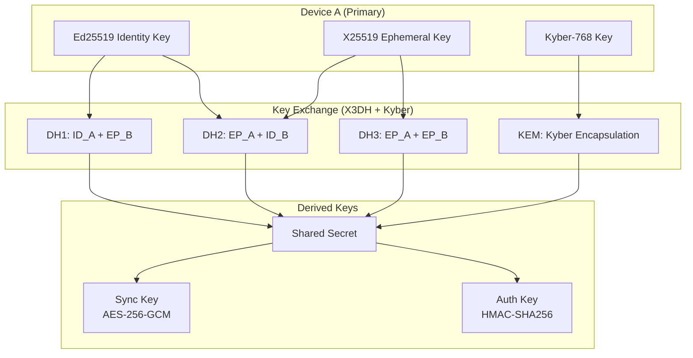

# ADR-004: Zero-Knowledge over End-to-End Encryption for Sync

## Status

**Accepted** | Date: 2024-01-15 | Author: Systems Architect

## Context

Project Truffle's core value proposition is user data sovereignty. We need a sync mechanism that:

- Enables multi-device synchronization
- Prevents infrastructure operators from accessing user content
- Survives server compromise without data exposure
- Complies with legal requests without betraying user trust
- Differentiates from competitors (Notion, Evernote)
- Supports the "Red Lines" in Section 1.2 of the specification

Two primary approaches were evaluated:
1. **Zero-Knowledge Architecture** (we cannot decrypt, even if compelled)
2. **End-to-End Encryption** (E2EE - we could decrypt with user cooperation)

## Decision

We will implement a **Zero-Knowledge Architecture** using:
- **X3DH** (Signal Protocol) for key exchange
- **Kyber-768** post-quantum hybrid (NIST FIPS 203)
- **AES-256-GCM** for symmetric encryption
- **Yjs CRDT** for conflict-free sync

## Consequences

### Positive

| Aspect | Zero-Knowledge Advantage |
|--------|--------------------------|
| **Mathematical Guarantee** | Cannot decrypt, even with full server access |
| **Legal Protection** | No ability to comply with data requests |
| **Marketing Differentiation** | "We can't see your data" vs "We choose not to" |
| **Trust Minimization** | Users don't need to trust us |
| **Compliance** | GDPR Article 32: "ongoing confidentiality" |
| **Incident Response** | Server breach = no data exposure |
| **User Psychology** | Absolute privacy increases adoption |

### Negative

| Aspect | Zero-Knowledge Challenge | Mitigation |
|--------|--------------------------|------------|
| **Key Recovery** | No password reset possible | Recovery codes + multi-device backup |
| **Feature Limitations** | Can't offer cloud search | Local search is faster anyway |
| **User Education** | Harder to explain | Clear UX, simple documentation |
| **Debugging** | Can't see user data in logs | Anonymous metrics only |

## Alternatives Considered

### End-to-End Encryption (E2EE)

**Pros:**
- Simpler implementation
- Key recovery possible (with user consent)
- Can offer cloud features (with user opt-in)

**Cons:**
- We *could* decrypt (technical capability exists)
- Legal compulsion could force decryption
- Server compromise exposes keys
- Less marketing differentiation

**Verdict:** Rejected because it doesn't provide the mathematical guarantee we need for our value proposition.

### Client-Side Encryption with Server Key Escrow

**Pros:**
- Key recovery possible
- Can assist users who forget passwords

**Cons:**
- We hold decryption capability
- Violates "Red Line" #2 (Zero-Knowledge)
- Trust model identical to traditional SaaS

**Verdict:** Rejected - fundamentally incompatible with our architecture.

### No Encryption (HTTPS only)

**Pros:**
- Simplest implementation
- Full server-side features possible

**Cons:**
- Complete violation of all "Red Lines"
- No differentiation from competitors
- Unacceptable privacy risk

**Verdict:** Rejected immediately.

## Implementation Details

### Cryptographic Architecture



### Device Pairing Ceremony

```rust
// truffle-core/src/sync/pairing.rs

/// Device pairing state machine
pub struct PairingCeremony {
    state: PairingState,
    identity_key: Ed25519KeyPair,
    ephemeral_key: X25519KeyPair,
    kyber_key: Kyber768KeyPair,
}

impl PairingCeremony {
    /// Step 1: Primary device generates QR code
    pub fn generate_qr_code(&self) -> Result<QRCode, PairingError> {
        let payload = PairingPayload {
            identity_fingerprint: self.identity_key.fingerprint(),
            ephemeral_public: self.ephemeral_key.public_key(),
            websocket_endpoint: "wss://relay.truffle.io/v1/sync",
            one_time_token: generate_secure_random(32),
        };
        
        Ok(QRCode::encode(&payload)?)
    }
    
    /// Step 2: Secondary device scans and responds
    pub fn process_scan_response(&mut self, response: PairingResponse) -> Result<(), PairingError> {
        // Verify signature
        response.verify_signature(&response.identity_key)?;
        
        // Perform X3DH handshake
        let shared_secret = self.x3dh_handshake(&response)?;
        
        // Derive keys
        let (sync_key, auth_key) = hkdf_sha256(
            &shared_secret,
            b"truffle-sync-v1",
            64
        );
        
        self.state = PairingState::AwaitingSasVerification {
            sync_key,
            auth_key,
        };
        
        Ok(())
    }
    
    /// Step 3: SAS verification (6-digit code)
    pub fn verify_sas(&self, local_code: &str, remote_code: &str) -> Result<(), PairingError> {
        if local_code != remote_code {
            return Err(PairingError::SasMismatch);
        }
        
        // Keys confirmed, pairing complete
        Ok(())
    }
}
```

### Sync Message Format

```rust
// truffle-core/src/sync/message.rs

pub const PROTOCOL_VERSION: u8 = 1;

/// Encrypted sync message
#[derive(Debug, Clone)]
pub struct SyncMessage {
    pub header: SyncHeader,
    pub payload: EncryptedPayload,
    pub mac: [u8; 32],
}

#[derive(Debug, Clone, Serialize, Deserialize)]
pub struct SyncHeader {
    pub protocol_version: u8,
    pub device_id: DeviceFingerprint,
    pub timestamp: u64,
    pub nonce: [u8; 12],
}

impl SyncMessage {
    /// Encrypt a payload for transmission
    pub fn encrypt(
        payload: &SyncPayload,
        sync_key: &[u8; 32],
        auth_key: &[u8; 32],
        device_id: DeviceFingerprint,
    ) -> Result<Self, CryptoError> {
        let nonce = generate_random_nonce();
        let plaintext = serialize(payload)?;
        
        // AES-256-GCM encryption
        let (ciphertext, tag) = aes_256_gcm_encrypt(&plaintext, sync_key, &nonce)?;
        
        let header = SyncHeader {
            protocol_version: PROTOCOL_VERSION,
            device_id,
            timestamp: unix_millis(),
            nonce,
        };
        
        // HMAC-SHA256 for authentication
        let mac = hmac_sha256(&serialize(&header)?, auth_key, &ciphertext)?;
        
        Ok(SyncMessage {
            header,
            payload: EncryptedPayload { ciphertext, tag },
            mac,
        })
    }
    
    /// Decrypt and verify a received message
    pub fn decrypt(
        &self,
        sync_key: &[u8; 32],
        auth_key: &[u8; 32],
    ) -> Result<SyncPayload, CryptoError> {
        // Verify MAC
        let expected_mac = hmac_sha256(
            &serialize(&self.header)?,
            auth_key,
            &self.payload.ciphertext
        )?;
        
        if !constant_time_eq(&self.mac, &expected_mac) {
            return Err(CryptoError::AuthenticationFailed);
        }
        
        // Decrypt payload
        let plaintext = aes_256_gcm_decrypt(
            &self.payload.ciphertext,
            sync_key,
            &self.header.nonce,
            &self.payload.tag,
        )?;
        
        deserialize(&plaintext)
    }
}

/// Decrypted payload contents
#[derive(Debug, Clone, Serialize, Deserialize)]
pub struct SyncPayload {
    pub crdt_update: Vec<u8>,  // Yjs binary update
    pub schema_version: String,
    pub deleted_artifacts: Vec<Uuid>,  // GDPR tombstones
}
```

### Relay Server (Zero-Access)

```typescript
// truffle-relay/src/handlers/message.ts

// The relay server CANNOT decrypt messages
// It only stores and forwards encrypted blobs

interface StoreMessageRequest {
  device_id: string;      // Hashed fingerprint
  recipient_id: string;   // Hashed fingerprint
  payload: string;        // Base64 encrypted blob (opaque to server)
  timestamp: number;
}

export async function storeMessage(
  request: StoreMessageRequest,
  env: Env
): Promise<Response> {
  // Validate request (rate limits, auth)
  await validateAuth(request);
  await checkRateLimit(request.device_id);
  
  // Store encrypted blob (we have NO decryption capability)
  const messageId = crypto.randomUUID();
  await env.MESSAGES.put(
    `${request.recipient_id}/${messageId}`,
    request.payload,
    { expirationTtl: 30 * 24 * 60 * 60 }  // 30 days
  );
  
  // Notify recipient via WebSocket (if connected)
  await notifyRecipient(request.recipient_id, messageId);
  
  return json({ message_id: messageId });
}
```

### Security Properties

```
┌─────────────────────────────────────────────────────────────┐
│                    ZERO-KNOWLEDGE PROOF                     │
├─────────────────────────────────────────────────────────────┤
│                                                             │
│  Given:                                                     │
│  - Full access to relay servers                             │
│  - All database contents                                    │
│  - All network traffic logs                                 │
│  - All source code                                          │
│                                                             │
│  We CANNOT:                                                 │
│  ❌ Decrypt user wiki content                               │
│  ❌ Decrypt user screenshot metadata                        │
│  ❌ Determine what users are storing                        │
│  ❌ Access any plaintext user data                          │
│                                                             │
│  We CAN:                                                    │
│  ✅ See encrypted blob sizes                                │
│  ✅ See sync frequency (timing metadata)                    │
│  ✅ See device fingerprints (hashed)                        │
│                                                             │
└─────────────────────────────────────────────────────────────┘
```

## Threat Model

| Threat | Mitigation | Verification |
|--------|------------|------------|
| Server compromise | No keys stored server-side | Formal verification |
| Man-in-the-middle | SAS verification during pairing | User comparison |
| Key theft (device) | Multi-device backup | Recovery ceremony |
| Quantum computing | Kyber-768 post-quantum hybrid | NIST FIPS 203 |
| Replay attacks | Timestamp + nonce validation | Protocol analysis |
| Metadata analysis | Constant-size padding | Traffic shaping |

## Compliance Implications

### GDPR Article 32

> "...the controller and the processor shall implement appropriate technical and organisational measures to ensure a level of security appropriate to the risk, including... encryption of personal data"

Our implementation:
- ✅ Encryption of all personal data
- ✅ Ongoing confidentiality (we cannot breach)
- ✅ Resilience (multi-device backup)
- ✅ Pseudonymization (hashed device IDs)

### Legal Requests

If compelled to provide user data:

```
Court: Provide the user's wiki content.
Truffle: We are technically incapable of doing so. We have no keys.
        Here is our architecture documentation and source code
        demonstrating this mathematical impossibility.

Court: Provide what you can.
Truffle: We can provide:
        - Encrypted blob sizes
        - Sync timestamps
        - Hashed device fingerprints
        
        We cannot provide:
        - Any decrypted content
        - Any encryption keys
        - Any ability to decrypt
```

## User Experience

### Key Management

```rust
// truffle-core/src/crypto/keys.rs

pub struct KeyManager {
    storage: SecureStorage,
}

impl KeyManager {
    /// Generate new master key from user password
    pub fn generate_master_key(password: &str) -> Result<MasterKey, KeyError> {
        // Argon2id key derivation
        let salt = generate_random(16);
        let key = argon2id(password, &salt, 
            m_cost: 65536,   // 64MB
            t_cost: 3,       // 3 iterations
            p_cost: 4        // 4 parallel
        )?;
        
        Ok(MasterKey { key, salt })
    }
    
    /// Store in secure enclave (iOS) / TPM (Windows) / Keychain (macOS)
    pub async fn store_securely(&self, key: &MasterKey) -> Result<(), KeyError> {
        self.storage.store("master_key", key, 
            accessibility: WhenUnlockedThisDeviceOnly
        ).await
    }
    
    /// Export recovery codes for key recovery
    pub fn generate_recovery_codes(&self) -> Vec<String> {
        // 12-word BIP39 mnemonic
        generate_mnemonic(128)
    }
}
```

### Device Pairing UX

1. **Primary device**: Settings → Add Device → Show QR Code
2. **Secondary device**: Settings → Pair Device → Scan QR Code
3. **Both devices**: Verify 6-digit code matches
4. **Done**: Devices sync automatically

## References

- [Signal Protocol Specification](https://signal.org/docs/)
- [NIST FIPS 203 (Kyber)](https://csrc.nist.gov/projects/post-quantum-cryptography)
- [Yjs Documentation](https://docs.yjs.dev/)
- [Project Truffle Security Whitepaper](./security/whitepaper.md)

---

**Decision Owner:** CTO  
**Stakeholders:** Engineering, Legal, Security  
**Review Date:** 2024-07-15 (6 months or post-quantum standard updates)
