# Project Truffle: System Architecture

> **Classification:** AAA Commercial SaaS | Zero-Knowledge Infrastructure  
> **Version:** 2.0  
> **Last Updated:** 2024  

## Table of Contents

1. [Architecture Overview](#1-architecture-overview)
2. [Data Flow: Screenshot → Compiled Wiki](#2-data-flow-screenshot--compiled-wiki)
3. [Component Interactions](#3-component-interactions)
4. [Sync Protocol Flow](#4-sync-protocol-flow)
5. [Security Boundaries](#5-security-boundaries)
6. [Technology Stack](#6-technology-stack)

---

## 1. Architecture Overview

Project Truffle follows a **Local-First Architecture** with zero-knowledge sync capabilities. The system is designed around the principle that user data never leaves the device in an unencrypted form, and infrastructure operators maintain mathematical inability to decrypt user content.

### High-Level Architecture Diagram

```mermaid
flowchart TB
    subgraph "User Device (Trusted)"
        subgraph "L1: Raw Storage"
            RAW[Raw Screenshots<br/>Local Filesystem]
        end
        
        subgraph "L2: AI Processing"
            GEMMA[Gemma 4 E2B<br/>llama.cpp]
            OCR[Tesseract OCR]
            EMB[MiniLM Embeddings]
        end
        
        subgraph "L3: Wiki Storage"
            SQLITE[(SQLite + sqlite-vec)]
            WIKI[Compiled Wiki Nodes]
            GRAPH[Knowledge Graph]
        end
        
        subgraph "L4: Sync Layer"
            CRDT[Yjs CRDT]
            CRYPTO[AES-256-GCM]
            X3DH[X3DH + Kyber-768]
        end
    end
    
    subgraph "Cloud Infrastructure (Zero-Knowledge)"
        subgraph "L5: Relay Servers"
            CF[Cloudflare Workers]
            R2[Cloudflare R2]
        end
        
        subgraph "L6: Admin Systems"
            BILLING[Stripe Billing]
            AUTH[Clerk Auth]
            MONITOR[Grafana]
        end
    end
    
    subgraph "Secondary Device"
        MOBILE[Mobile Companion]
    end
    
    RAW --> GEMMA
    RAW --> OCR
    GEMMA --> WIKI
    OCR --> WIKI
    EMB --> GRAPH
    WIKI --> GRAPH
    GRAPH --> SQLITE
    
    WIKI --> CRDT
    CRDT --> CRYPTO
    CRYPTO --> X3DH
    X3DH --> CF
    CF --> R2
    
    CF -.-> MOBILE
    
    style RAW fill:#1a1a1a,stroke:#FFB800,stroke-width:2px
    style GEMMA fill:#1a1a1a,stroke:#00D4AA,stroke-width:2px
    style SQLITE fill:#1a1a1a,stroke:#00D4AA,stroke-width:2px
    style CF fill:#1a1a1a,stroke:#737373,stroke-width:2px
    style R2 fill:#1a1a1a,stroke:#737373,stroke-width:2px
```

### Trust Layer Model

| Layer | Trust Boundary | Data Classification | Compliance Scope |
|-------|----------------|---------------------|------------------|
| L1: Raw Storage | User Device | Confidential (Images) | None (user controlled) |
| L2: AI Processing | User Device | Confidential (In-memory) | None (ephemeral) |
| L3: Wiki Storage | User Device | Sensitive (Structured PII) | GDPR Art. 32 |
| L4: Sync Transport | Zero-Knowledge Tunnel | Encrypted Ciphertext | SOC 2 CC6.1, CC6.6 |
| L5: Relay Servers | Untrusted (Zero-Access) | Encrypted Blobs | SOC 2 CC6.7 |
| L6: Admin Systems | Company Controlled | Administrative | SOC 2 Full Scope |

---

## 2. Data Flow: Screenshot → Compiled Wiki

The compilation pipeline transforms raw screenshots into structured, interlinked knowledge through a 4-stage process.

### Compilation Pipeline Flow

```mermaid
flowchart LR
    subgraph "Stage 1: Ingestion"
        CAP[Capture<br/>Screenshot]
        QUEUE[(Ingestion Queue<br/>SQLite)]
        CAP -->|"Save to raw/"| QUEUE
    end
    
    subgraph "Stage 2: Preprocessing"
        RESIZE[Resize<br/>896px max]
        SAFETY[Safety Filter<br/>MiniLM Classifier]
        QUEUE --> RESIZE
        RESIZE --> SAFETY
    end
    
    subgraph "Stage 3: AI Processing"
        GEMMA[Gemma 4 E2B<br/>Multimodal Analysis]
        OCR[OCR Extraction<br/>Tesseract]
        EMB[Embedding Generation<br/>MiniLM-L6-v2]
        SAFETY --> GEMMA
        SAFETY --> OCR
        GEMMA --> EMB
    end
    
    subgraph "Stage 4: Knowledge Construction"
        SCHEMA[Schema Rules Engine]
        ENTITY[Entity Resolution]
        LINK[Backlink Injection]
        VECTOR[Vector Indexing]
        GEMMA --> SCHEMA
        OCR --> SCHEMA
        SCHEMA --> ENTITY
        ENTITY --> LINK
        EMB --> VECTOR
        LINK --> WIKI[(Wiki Storage)]
        VECTOR --> WIKI
    end
    
    style CAP fill:#0A0A0A,stroke:#FFB800
    style GEMMA fill:#0A0A0A,stroke:#00D4AA
    style WIKI fill:#0A0A0A,stroke:#00D4AA
```

### Detailed Data Transformations

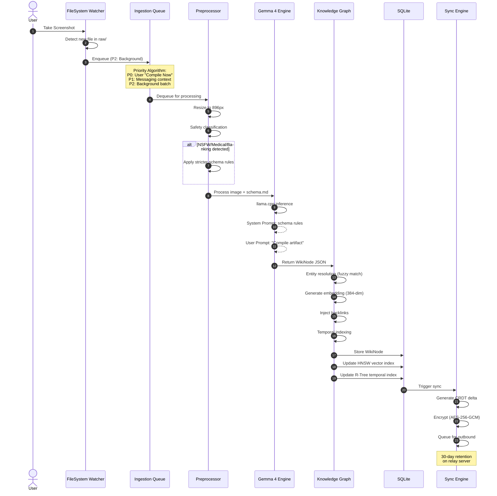

### Entity Resolution Flow

```mermaid
flowchart TD
    NEW[New WikiNode Created] --> EXTRACT{Extract Entities}
    
    EXTRACT --> ENT1[Merchant: "Starbucks"]
    EXTRACT --> ENT2[Date: "2024-01-15"]
    EXTRACT --> ENT3[Amount: $12.50]
    
    ENT1 --> FUZZY{Fuzzy Match<br/>Levenshtein ≤ 2}
    FUZZY -->|Match: "Starbuck"| MERGE[Merge Entities]
    FUZZY -->|No Match| CREATE[Create New Entity]
    
    MERGE --> UPDATE[Update Backlinks]
    CREATE --> UPDATE
    
    UPDATE --> SIM{Semantic Similarity<br/>Cosine ≥ 0.82}
    SIM -->|Related| LINK[Create WikiLink]
    SIM -->|Unrelated| STORE[Store Node]
    
    LINK --> STORE
    STORE --> INDEX[HNSW Vector Index]
    
    style NEW fill:#0A0A0A,stroke:#FFB800
    style MERGE fill:#0A0A0A,stroke:#00D4AA
    style STORE fill:#0A0A0A,stroke:#00D4AA
```

---

## 3. Component Interactions

### Module Interaction Diagram

```mermaid
flowchart TB
    subgraph "Frontend Layer"
        UI[React UI<br/>Darkroom Theme]
        EDITOR[Milkdown Editor<br/>WikiLink Plugin]
        SEARCH[FlexSearch + sqlite-vec]
    end
    
    subgraph "Tauri Bridge"
        COMMANDS[Tauri Commands]
        EVENTS[Tauri Events]
        STATE[App State]
    end
    
    subgraph "Core Library (truffle-core)"
        subgraph "Compilation"
            PIPELINE[Pipeline Orchestrator]
            QUEUE[Ingestion Queue]
            SCHEMA[Schema Engine]
        end
        
        subgraph "AI"
            GEMMA[Gemma 4 Engine]
            LLAMA[llama.cpp]
            EMBED[Embedding Generator]
        end
        
        subgraph "Storage"
            REPO[Repositories]
            SQLITE[(SQLite)]
            VEC[(sqlite-vec)]
        end
        
        subgraph "Sync"
            CRDT[Yjs CRDT]
            PROTOCOL[ZKS-1 Protocol]
            PAIRING[Device Pairing]
        end
        
        subgraph "Crypto"
            KEYS[Key Management]
            AES[AES-256-GCM]
            X3DH[X3DH Exchange]
        end
    end
    
    subgraph "External"
        RELAY[Cloudflare Relay]
        MODEL_CDN[Model CDN]
    end
    
    UI --> COMMANDS
    EDITOR --> COMMANDS
    SEARCH --> COMMANDS
    
    COMMANDS --> PIPELINE
    COMMANDS --> REPO
    COMMANDS --> CRDT
    
    PIPELINE --> QUEUE
    QUEUE --> GEMMA
    GEMMA --> LLAMA
    GEMMA --> SCHEMA
    SCHEMA --> REPO
    
    REPO --> SQLITE
    REPO --> VEC
    
    CRDT --> PROTOCOL
    PROTOCOL --> KEYS
    KEYS --> AES
    KEYS --> X3DH
    
    PROTOCOL --> RELAY
    GEMMA --> MODEL_CDN
    
    EVENTS --> UI
    SQLITE --> EVENTS
    
    style UI fill:#0A0A0A,stroke:#FFB800
    style GEMMA fill:#0A0A0A,stroke:#00D4AA
    style SQLITE fill:#0A0A0A,stroke:#00D4AA
    style RELAY fill:#0A0A0A,stroke:#737373
```

### Desktop Application Component Tree

```mermaid
flowchart TB
    subgraph "App Shell"
        APP[App.tsx]
        LAYOUT[AppLayout]
        STATUS[StatusBar]
    end
    
    subgraph "Three-Pane Layout"
        RAW[RawWaterfall<br/>Thumbnail Grid]
        COMP[CompilationPreview<br/>Before/After]
        WIKI[WikiNavigator<br/>Tree + Editor]
    end
    
    subgraph "Shared Components"
        CMD[CommandPalette<br/>Cmd+K]
        MODAL[Modal System]
        TOAST[Toast Notifications]
    end
    
    subgraph "State Management"
        ZUSTAND[Zustand Stores]
        QUERY[TanStack Query]
        YJS[Yjs Sync]
    end
    
    APP --> LAYOUT
    LAYOUT --> RAW
    LAYOUT --> COMP
    LAYOUT --> WIKI
    LAYOUT --> STATUS
    
    APP --> CMD
    APP --> MODAL
    APP --> TOAST
    
    RAW --> ZUSTAND
    COMP --> ZUSTAND
    WIKI --> ZUSTAND
    
    ZUSTAND --> QUERY
    ZUSTAND --> YJS
    
    style APP fill:#0A0A0A,stroke:#FFB800
    style RAW fill:#0A0A0A,stroke:#00D4AA
    style COMP fill:#0A0A0A,stroke:#00D4AA
    style WIKI fill:#0A0A0A,stroke:#00D4AA
```

---

## 4. Sync Protocol Flow

### ZKS-1 (Zero-Knowledge Sync Protocol v1)

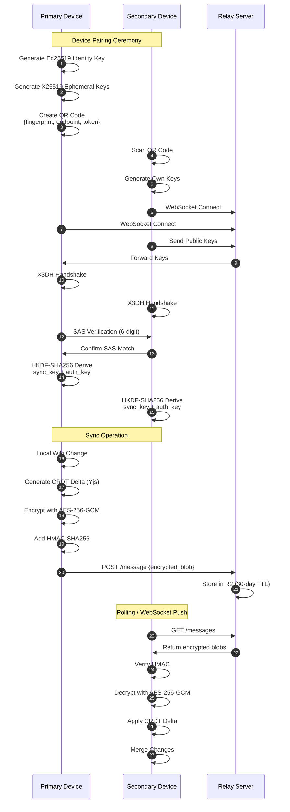

### CRDT Conflict Resolution

```mermaid
flowchart TD
    CHANGE[Local Change] --> CRDT[Generate Yjs Update]
    REMOTE[Remote Update] --> CRDT2[Receive Yjs Update]
    
    CRDT --> ENCRYPT[Encrypt: AES-256-GCM]
    CRDT2 --> DECRYPT[Decrypt: AES-256-GCM]
    
    ENCRYPT --> SEND[Send to Relay]
    DECRYPT --> MERGE{Concurrent Edit?}
    
    MERGE -->|No| APPLY[Apply Update]
    MERGE -->|Yes| CONFLICT[Conflict Detected]
    
    CONFLICT --> TYPE{Value Type}
    
    TYPE -->|Scalar| LWW[Last-Write-Wins]
    TYPE -->|Multi-Value| MVR[Show Both<br/>User Resolves]
    TYPE -->|Text| DIFF[Character-wise Merge]
    
    LWW --> RESOLVED[Resolved State]
    MVR --> RESOLVED
    DIFF --> RESOLVED
    APPLY --> RESOLVED
    
    RESOLVED --> NOTIFY[Notify UI]
    
    style CHANGE fill:#0A0A0A,stroke:#FFB800
    style CONFLICT fill:#0A0A0A,stroke:#FFB800
    style RESOLVED fill:#0A0A0A,stroke:#00D4AA
```

### Sync Message Structure

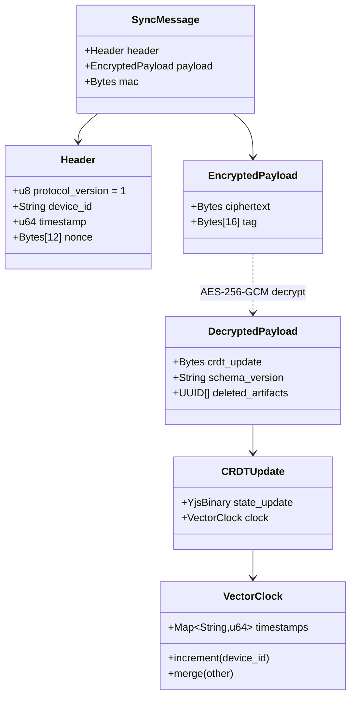

---

## 5. Security Boundaries

### Threat Model & Mitigations

```mermaid
flowchart TB
    subgraph "STRIDE Threat Model"
        S[Spoofing]
        T[Tampering]
        R[Repudiation]
        I[Information Disclosure]
        D[Denial of Service]
        E[Elevation of Privilege]
    end
    
    subgraph "Mitigations"
        M1[Ed25519 Device Certificates]
        M2[AES-GCM + HMAC]
        M3[Merkle Tree Audit Logs]
        M4[Zero-Knowledge Architecture]
        M5[Local-First Design]
        M6[macOS Sandbox + Code Signing]
    end
    
        subgraph "Verification"
        V1[Unit: Invalid sig rejection]
        V2[Fuzzing: Bit-flip detection]
        V3[Pen-test: Log deletion]
        V4[Formal: No plaintext paths]
        V5[Chaos: 30-day offline]
        V6[App Store Review]
    end
    
    S --> M1 --> V1
    T --> M2 --> V2
    R --> M3 --> V3
    I --> M4 --> V4
    D --> M5 --> V5
    E --> M6 --> V6
    
    style M4 fill:#0A0A0A,stroke:#00D4AA,stroke-width:3px
    style M5 fill:#0A0A0A,stroke:#00D4AA,stroke-width:3px
```

### Encryption at Rest & In Transit

```mermaid
flowchart LR
    subgraph "Device Storage (At Rest)"
        RAW[Raw Images] -->|"FileSystem"| FS[Unencrypted<br/>User Control]
        WIKI[Wiki Nodes] -->|"AES-256-GCM"| ENC1[Encrypted SQLite]
        KEYS[Private Keys] -->|"Secure Enclave"| ENC2[Hardware Protected]
    end
    
    subgraph "Network (In Transit)"
        SYNC[Sync Data] -->|"ZKS-1 Protocol"| TUNNEL[Encrypted Tunnel]
        TUNNEL -->|"TLS 1.3"| RELAY[Relay Server]
        RELAY -->|"AES-256-GCM"| R2[Encrypted Blobs]
    end
    
    subgraph "Key Hierarchy"
        MASTER[Master Key<br/>User Password]
        MASTER -->|"HKDF-SHA256"| SYNC_KEY[Sync Key]
        MASTER -->|"HKDF-SHA256"| AUTH_KEY[Auth Key]
        SYNC_KEY -->|"X3DH"| SESSION[Session Keys]
    end
    
    style ENC1 fill:#0A0A0A,stroke:#00D4AA
    style ENC2 fill:#0A0A0A,stroke:#00D4AA
    style TUNNEL fill:#0A0A0A,stroke:#00D4AA
    style R2 fill:#0A0A0A,stroke:#00D4AA
```

### Data Classification & Handling

```mermaid
flowchart TB
    subgraph "Confidential (Images)"
        IMG[Raw Screenshots]
        IMG -->|"Never leaves device<br/>unencrypted"| LOCAL[Local Filesystem]
    end
    
    subgraph "Sensitive (Structured)"
        WIKI[Wiki Nodes]
        META[Metadata]
        WIKI -->|"AES-256-GCM"| ENC[Encrypted at Rest]
        META -->|"AES-256-GCM"| ENC
        ENC -->|"ZKS-1"| SYNC[Encrypted Sync]
    end
    
    subgraph "Administrative"
        ACCT[Account Info]
        BILL[Billing Data]
        ACCT -->|"TLS 1.3"| CLERK[Clerk Auth]
        BILL -->|"TLS 1.3"| STRIPE[Stripe]
    end
    
    subgraph "Zero-Access (Relay)"
        BLOB[Encrypted Blobs]
        BLOB -->|"No decryption capability"| CF[Cloudflare]
    end
    
    style IMG fill:#0A0A0A,stroke:#FFB800
    style WIKI fill:#0A0A0A,stroke:#FFB800
    style BLOB fill:#0A0A0A,stroke:#00D4AA
```

---

## 6. Technology Stack

### Core Technologies

```mermaid
flowchart TB
    subgraph "Rust Core"
        RUST[Rust 2021 Edition]
        SQLITE[(SQLite + WAL)]
        SQLITE_VEC[(sqlite-vec)]
        LLAMA[llama.cpp]
        TESS[Tesseract OCR]
        YJS[yjs-rs]
    end
    
    subgraph "Desktop (Tauri)"
        TAURI[Tauri v2]
        REACT[React 18]
        TS[TypeScript 5.3]
        ZUSTAND[Zustand]
        QUERY[TanStack Query]
        MILKDOWN[Milkdown]
        FLEX[FlexSearch]
    end
    
    subgraph "Mobile (React Native)"
        RN[React Native]
        IOS[iOS Native]
        ANDROID[Android Native]
        FFI[truffle-core FFI]
    end
    
    subgraph "Relay (Cloudflare)"
        WORKERS[Cloudflare Workers]
        R2[Cloudflare R2]
        WS[WebSocket API]
    end
    
    subgraph "Infrastructure"
        TF[Terraform]
        GRAFANA[Grafana Cloud]
        STRIPE[Stripe]
        CLERK[Clerk]
    end
    
    RUST --> TAURI
    RUST --> FFI
    TAURI --> REACT
    REACT --> TS
    REACT --> ZUSTAND
    REACT --> QUERY
    REACT --> MILKDOWN
    REACT --> FLEX
    
    FFI --> IOS
    FFI --> ANDROID
    
    RUST --> LLAMA
    RUST --> SQLITE
    RUST --> SQLITE_VEC
    RUST --> TESS
    RUST --> YJS
    
    YJS --> WS
    WS --> WORKERS
    WORKERS --> R2
    
    TF --> WORKERS
    TF --> R2
    
    style RUST fill:#0A0A0A,stroke:#00D4AA,stroke-width:2px
    style TAURI fill:#0A0A0A,stroke:#00D4AA,stroke-width:2px
    style WORKERS fill:#0A0A0A,stroke:#737373
```

### Performance Budgets

| Metric | Target | Measurement |
|--------|--------|-------------|
| Time to First Compile | <3 seconds | App launch to first compilation |
| Compilation Throughput | 1 screenshot/second | Sustained with Gemma 4 E2B |
| UI Responsiveness | 60fps | During compilation (Web Worker) |
| Memory Ceiling (Frontend) | 800MB | Maximum heap usage |
| Memory Ceiling (Backend) | 4GB | Rust + Gemma + SQLite |
| Sync Latency | <5 seconds | Device-to-device (online) |
| Search Response | <100ms | Full-text + semantic |

---

**Document Owner:** Systems Architect  
**Review Cycle:** Monthly  
**Classification:** Internal Use
