# Project Truffle: Build Guide

> **Classification:** AAA Commercial SaaS | Build Instructions  
> **Version:** 2.0 Final  
> **Status:** ✅ PRODUCTION READY

---

## Table of Contents

1. [Prerequisites](#prerequisites)
2. [Build Order & Dependencies](#build-order--dependencies)
3. [Platform-Specific Setup](#platform-specific-setup)
4. [Step-by-Step Build](#step-by-step-build)
5. [Verification & Testing](#verification--testing)
6. [Troubleshooting](#troubleshooting)

---

## Prerequisites

### All Platforms

```bash
# 1. Git
git --version  # Requires 2.30+

# 2. Rust + Cargo
curl --proto '=https' --tlsv1.2 -sSf https://sh.rustup.rs | sh
source $HOME/.cargo/env
rustc --version  # Requires 1.75+
cargo --version  # Requires 1.75+

# 3. Node.js 18+
# macOS/Linux
curl -fsSL https://deb.nodesource.com/setup_20.x | sudo -E bash -
sudo apt-get install -y nodejs

# Or use nvm
curl -o- https://raw.githubusercontent.com/nvm-sh/nvm/v0.39.0/install.sh | bash
nvm install 20
nvm use 20

node --version   # Requires v18+
npm --version    # Requires v9+

# 4. Python 3.9+ (for some native dependencies)
python3 --version
```

### macOS Specific

```bash
# Xcode Command Line Tools
xcode-select --install

# Homebrew (recommended)
/bin/bash -c "$(curl -fsSL https://raw.githubusercontent.com/Homebrew/install/HEAD/install.sh)"

# Additional dependencies
brew install cmake pkg-config openssl
```

### Linux (Ubuntu/Debian) Specific

```bash
# Tauri dependencies
sudo apt update
sudo apt install -y \
    libwebkit2gtk-4.1-dev \
    build-essential \
    curl \
    wget \
    file \
    libssl-dev \
    libgtk-3-dev \
    libayatana-appindicator3-dev \
    librsvg2-dev \
    cmake \
    pkg-config

# For llama.cpp optimizations
sudo apt install -y clang
```

### Windows Specific

```powershell
# Install Visual Studio Build Tools
# Download from: https://visualstudio.microsoft.com/downloads/
# Required: C++ build tools, Windows SDK

# Install Rust via rustup.rs
# Install Node.js via nodejs.org

# Install LLVM for llama.cpp
# Download from: https://github.com/llvm/llvm-project/releases
```

### Mobile Development

#### iOS Requirements

```bash
# macOS only
# Xcode 15+
xcode-select --install

# CocoaPods
sudo gem install cocoapods

# Verify
xcodebuild -version
```

#### Android Requirements

```bash
# Android Studio
# Download from: https://developer.android.com/studio

# Set environment variables
export ANDROID_HOME=$HOME/Android/Sdk
export PATH=$PATH:$ANDROID_HOME/emulator
export PATH=$PATH:$ANDROID_HOME/platform-tools

# Verify
adb --version
```

---

## Build Order & Dependencies

```mermaid
flowchart TB
    subgraph "Phase 1: Core Dependencies"
        CRYPTO[truffle-crypto]
        AI[truffle-ai]
    end
    
    subgraph "Phase 2: Core Library"
        CORE[truffle-core]
    end
    
    subgraph "Phase 3: Applications"
        DESKTOP[truffle-desktop]
        MOBILE[truffle-mobile]
    end
    
    subgraph "Phase 4: Infrastructure"
        RELAY[truffle-relay]
        INFRA[truffle-infra]
    end
    
    CRYPTO --> CORE
    AI --> CORE
    CORE --> DESKTOP
    CORE --> MOBILE
    CORE -.-> RELAY
    
    style CRYPTO fill:#0A0A0A,stroke:#00D4AA
    style CORE fill:#0A0A0A,stroke:#00D4AA
    style DESKTOP fill:#0A0A0A,stroke:#FFB800
```



### Build Order Summary

```
1. Build truffle-crypto (Rust)
2. Build truffle-ai (Rust)
3. Build truffle-core (Rust) - depends on crypto & ai
4. Build truffle-desktop (Tauri) - depends on core
5. Build truffle-relay (Cloudflare) - independent
6. Build truffle-mobile (iOS/Android) - depends on core
```

---

## Step-by-Step Build

### Step 0: Clone Repository

```bash
git clone https://github.com/truffle/truffle.git
cd truffle

# Verify directory structure
ls -la
truffle-core/ truffle-crypto/ truffle-ai/ truffle-desktop/ 
truffle-relay/ truffle-mobile/ truffle-infra/ truffle-qa/
```

### Step 1: Build truffle-crypto

```bash
cd truffle-crypto

# Build in release mode
cargo build --release

# Run tests
cargo test

# Expected output:
# test result: ok. 47 passed; 0 failed

# Verify library exists
ls -la target/release/libtruffle_crypto.a  # macOS/Linux
ls -la target/release/truffle_crypto.dll   # Windows

cd ..
```

### Step 2: Build truffle-ai

```bash
cd truffle-ai

# Download Gemma 4 model (one-time)
./scripts/download_model.sh
# Or manually:
# wget https://huggingface.co/google/gemma-4-2b-it/resolve/main/gemma-4-2b-it-Q4_K_M.gguf
# mv gemma-4-2b-it-Q4_K_M.gguf models/

# Build
cargo build --release

# Run tests (without GPU)
cargo test --features cpu-only

# Run tests (with GPU - Metal/CUDA)
cargo test --features gpu

# Expected output:
# test result: ok. 32 passed; 0 failed

cd ..
```

### Step 3: Build truffle-core

```bash
cd truffle-core

# Build (depends on crypto and ai)
cargo build --release

# Run unit tests
cargo test --lib

# Run integration tests
cargo test --test integration_tests

# Expected output:
# test result: ok. 89 passed; 0 failed

# Verify library
ls -la target/release/libtruffle_core.a
cd ..
```

### Step 4: Build truffle-desktop (Tauri)

```bash
cd truffle-desktop

# Install Node dependencies
npm install

# Build frontend
npm run build

# Build Tauri app (development)
npm run tauri dev

# Build Tauri app (production)
npm run tauri build

# Output locations:
# macOS: src-tauri/target/release/bundle/macos/Truffle.app
# Linux: src-tauri/target/release/bundle/deb/*.deb
# Windows: src-tauri/target/release/bundle/msi/*.msi

cd ..
```

### Step 5: Build truffle-relay (Cloudflare Workers)

```bash
cd truffle-relay

# Install dependencies
npm install

# Install Wrangler CLI
npm install -g wrangler

# Login to Cloudflare (one-time)
wrangler login

# Development server
npm run dev

# Deploy to staging
npm run deploy:staging

# Deploy to production
npm run deploy:production

cd ..
```

### Step 6: Build truffle-mobile (iOS)

```bash
cd truffle-mobile

# Install dependencies
npm install

# iOS setup
cd ios
pod install
cd ..

# Build for iOS simulator
npx react-native run-ios --simulator="iPhone 15 Pro"

# Build for physical device (requires Apple Developer account)
npx react-native run-ios --device "Your iPhone"

# Archive for App Store
npx react-native run-ios --configuration Release --scheme TruffleMobile

cd ..
```

### Step 6b: Build truffle-mobile (Android)

```bash
cd truffle-mobile

# Install dependencies
npm install

# Android setup
cd android
./gradlew clean
./gradlew assembleDebug

# Build APK
cd ..
npx react-native run-android

# Build release APK
cd android
./gradlew assembleRelease

# Output: android/app/build/outputs/apk/release/app-release.apk

cd ../..
```

### Step 7: Setup truffle-infra (Terraform)

```bash
cd truffle-infra/terraform

# Initialize Terraform
terraform init

# Plan changes
terraform plan -var-file=environments/dev/terraform.tfvars

# Apply to dev
terraform apply -var-file=environments/dev/terraform.tfvars

# Apply to production (careful!)
terraform apply -var-file=environments/prod/terraform.tfvars

cd ../..
```

---

## Verification & Testing

### Full Test Suite

```bash
# Run all Rust tests
cargo test --workspace

# Run all Node tests
npm test --workspaces

# Run relay tests
cd truffle-relay
npm test
cd ..

# Run mobile tests
cd truffle-mobile
npm test
cd ..
```

### Red Lines Verification

```bash
# Run red line verification script
./scripts/verify_red_lines.sh

# Expected output:
# ============================================
# RED LINES VERIFICATION
# ============================================
# [✅] Sovereignty: User data stays on device
# [✅] Zero-Knowledge: We cannot decrypt content
# [✅] Survival Mode: 100% offline capable
# [✅] Exit Capability: Export in <5 minutes
# [✅] Economic Viability: 85%+ gross margin (92.07%)
# ============================================
# ALL RED LINES SATISFIED ✅
```

### Integration Tests

```bash
# Test Core ↔ Crypto integration
cargo test -p truffle-core crypto_integration

# Test Core ↔ AI integration
cargo test -p truffle-core ai_pipeline

# Test Desktop ↔ Core integration
cd truffle-desktop
npm run test:integration
cd ..

# Test Sync protocol
cargo test -p truffle-core sync_protocol
```

### Performance Tests

```bash
# Compilation throughput
cargo bench -p truffle-core compilation

# Search performance
cargo bench -p truffle-core search

# Export performance
cargo test -p truffle-core export_performance -- --nocapture
```

---

## Troubleshooting

### Common Issues

#### Rust Build Failures

```bash
# Issue: "linker cc not found"
# Fix: Install build-essential
sudo apt-get install build-essential

# Issue: OpenSSL not found
# Fix: Install OpenSSL development headers
sudo apt-get install libssl-dev

# Issue: SQLite not found
# Fix: Install SQLite development headers
sudo apt-get install libsqlite3-dev
```

#### llama.cpp Build Issues

```bash
# Issue: CMake not found
sudo apt-get install cmake

# Issue: Metal not available (macOS)
# Ensure Xcode is properly installed
xcode-select --install
sudo xcode-select -s /Applications/Xcode.app/Contents/Developer

# Issue: CUDA not found (Linux)
# Install CUDA toolkit from NVIDIA
```

#### Tauri Build Issues

```bash
# Issue: WebKit not found (Linux)
sudo apt-get install libwebkit2gtk-4.1-dev

# Issue: AppIndicator not found
sudo apt-get install libayatana-appindicator3-dev

# Issue: librsvg not found
sudo apt-get install librsvg2-dev
```

#### Mobile Build Issues

```bash
# iOS: CocoaPods issues
cd ios
pod deintegrate
pod install
cd ..

# Android: Gradle issues
cd android
./gradlew clean
./gradlew --stop
./gradlew assembleDebug
cd ..

# React Native: Metro bundler issues
npx react-native start --reset-cache
```

### Clean Build

```bash
# Clean everything
./scripts/clean_build.sh

# Or manually:
# Rust
cargo clean

# Node
rm -rf node_modules
rm -rf truffle-*/node_modules
rm -rf truffle-desktop/src-tauri/target

# iOS
cd truffle-mobile/ios
rm -rf Pods
rm -rf build
pod install
cd ../..

# Android
cd truffle-mobile/android
./gradlew clean
cd ../..

# Rebuild everything
./scripts/build_all.sh
```

---

## Build Scripts Reference

| Script | Purpose | Location |
|--------|---------|----------|
| `build_all.sh` | Build all components | `/scripts/build_all.sh` |
| `clean_build.sh` | Clean and rebuild | `/scripts/clean_build.sh` |
| `verify_red_lines.sh` | Verify constraints | `/scripts/verify_red_lines.sh` |
| `run_tests.sh` | Run all tests | `/scripts/run_tests.sh` |
| `download_model.sh` | Download Gemma 4 | `/truffle-ai/scripts/download_model.sh` |

---

## Development Workflow

### Daily Development

```bash
# 1. Start relay (if testing sync)
cd truffle-relay && npm run dev

# 2. Start desktop in dev mode (new terminal)
cd truffle-desktop && npm run tauri dev

# 3. Make changes, tests auto-run

# 4. Before commit
./scripts/run_tests.sh
./scripts/verify_red_lines.sh
```

### Release Workflow

```bash
# 1. Update version
cargo workspaces version --all patch  # or minor/major

# 2. Run full test suite
./scripts/run_tests.sh

# 3. Build all platforms
./scripts/build_release.sh

# 4. Sign binaries
./scripts/sign_binaries.sh

# 5. Create release
git tag v0.1.0
git push origin v0.1.0

# 6. Deploy relay
./scripts/deploy_relay.sh production
```

---

**Document Owner:** Systems Architect  
**Last Updated:** 2024  
**Status:** ✅ PRODUCTION READY
