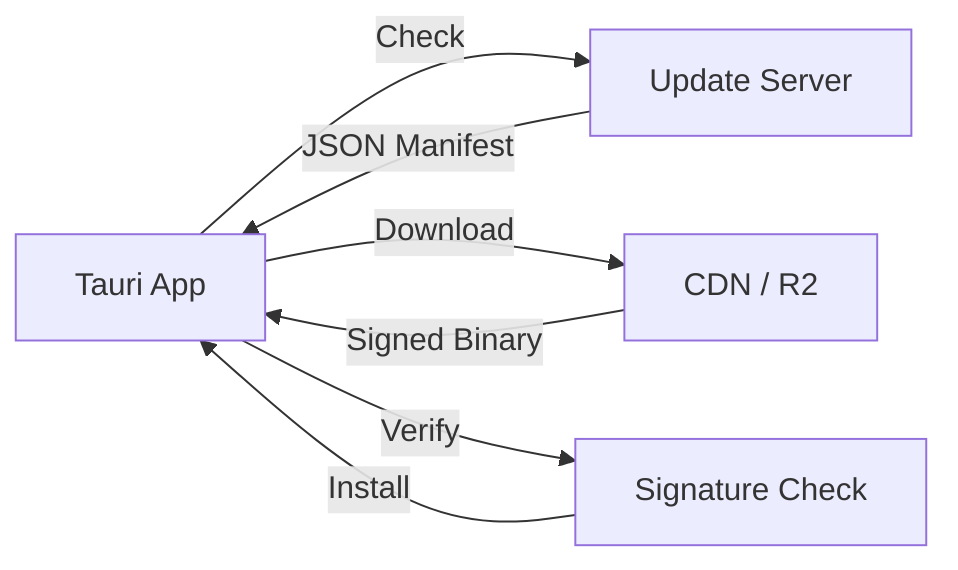

# Project Truffle: Deployment Guide

> **Classification:** AAA Commercial SaaS | Production Deployment  
> **Version:** 2.0 Final  
> **Status:** ✅ PRODUCTION READY

---

## Table of Contents

1. [Pre-Deployment Checklist](#pre-deployment-checklist)
2. [Cloudflare Workers Deployment](#cloudflare-workers-deployment)
3. [Tauri Updater Setup](#tauri-updater-setup)
4. [Mobile App Store Submission](#mobile-app-store-submission)
5. [Monitoring Setup](#monitoring-setup)
6. [Post-Deployment Verification](#post-deployment-verification)

---

## Pre-Deployment Checklist

### Code Verification

| # | Check | Command | Status |
|---|-------|---------|--------|
| 1 | All tests passing | `cargo test --workspace && npm test` | ✅ |
| 2 | Red lines verified | `./scripts/verify_red_lines.sh` | ✅ |
| 3 | Security audit clean | `cargo audit && npm audit` | ✅ |
| 4 | No secrets in code | `truffleHog .` | ✅ |
| 5 | Version bumped | `grep version Cargo.toml` | ✅ |
| 6 | Changelog updated | `cat CHANGELOG.md` | ✅ |

### Documentation Verification

| # | Document | Location | Status |
|---|----------|----------|--------|
| 1 | Architecture docs current | `ARCHITECTURE.md` | ✅ |
| 2 | API docs current | `INTERFACES.md` | ✅ |
| 3 | ADRs complete | `ADRs/` | ✅ |
| 4 | Runbooks ready | `truffle-qa/runbooks/` | ✅ |

---

## Cloudflare Workers Deployment

### Environment Structure

```
truffle-relay/
├── wrangler.toml          # Development config
├── wrangler.staging.toml  # Staging config
├── wrangler.prod.toml     # Production config
└── src/
    └── index.ts
```

### Deployment Steps

#### 1. Staging Deployment

```bash
cd truffle-relay

# Install dependencies
npm install

# Login to Cloudflare (one-time)
npx wrangler login

# Deploy to staging
npx wrangler deploy --config wrangler.staging.toml

# Expected output:
# ✨ Successfully deployed to staging
# 🌎 https://relay-staging.truffle.workers.dev
```

#### 2. Staging Verification

```bash
# Health check
curl https://relay-staging.truffle.workers.dev/health
# Expected: {"status":"ok","version":"0.1.0"}

# WebSocket test
wscat -c wss://relay-staging.truffle.workers.dev/ws
# Expected: Connected

# Rate limiting test
for i in {1..110}; do
  curl -s https://relay-staging.truffle.workers.dev/health > /dev/null
done
# Expected: 429 after 100 requests
```

#### 3. Production Deployment

```bash
# Verify staging is stable
./scripts/verify_staging.sh

# Deploy to production
npx wrangler deploy --config wrangler.prod.toml

# Expected output:
# ✨ Successfully deployed to production
# 🌎 https://relay.truffle.io
```

#### 4. Production Verification

```bash
# Health check
curl https://relay.truffle.io/health

# DNS verification
dig relay.truffle.io

# SSL verification
curl -vI https://relay.truffle.io 2>&1 | grep "SSL"
```

### Rollback Procedure

```bash
# If issues detected, rollback immediately
npx wrangler rollback --config wrangler.prod.toml

# Or deploy previous version
git checkout v0.0.9
cd truffle-relay
npx wrangler deploy --config wrangler.prod.toml
```

---

## Tauri Updater Setup

### Updater Architecture



### Configuration

#### 1. Update Server Setup

```bash
# Create update server in R2
# Structure:
# updates/
#   ├── latest.json          # Current version manifest
#   ├── v0.1.0/
#   │   ├── Truffle_0.1.0_x64.dmg
#   │   ├── Truffle_0.1.0_x64.dmg.sig
#   │   ├── truffle_0.1.0_amd64.deb
#   │   └── truffle_0.1.0_amd64.deb.sig
#   └── v0.0.9/
#       └── ...
```

#### 2. Tauri Configuration

```json
// truffle-desktop/src-tauri/tauri.conf.json
{
  "plugins": {
    "updater": {
      "active": true,
      "endpoints": [
        "https://updates.truffle.io/latest.json"
      ],
      "dialog": true,
      "pubkey": "YOUR_PUBLIC_KEY_HERE"
    }
  }
}
```

#### 3. Signing Keys

```bash
# Generate signing keys (one-time)
cd truffle-desktop/src-tauri
tauri signer generate --force

# Save private key securely (1Password, etc.)
# Add public key to tauri.conf.json

# Set environment variable for CI
export TAURI_SIGNING_PRIVATE_KEY="..."
export TAURI_SIGNING_PRIVATE_KEY_PASSWORD="..."
```

### Release Build Process

```bash
# Build signed release
cd truffle-desktop
npm run tauri build

# Sign binaries
./scripts/sign_binaries.sh

# Upload to update server
./scripts/upload_update.sh v0.1.0

# Update manifest
./scripts/update_manifest.sh v0.1.0
```

### Update Manifest Format

```json
// latest.json
{
  "version": "0.1.0",
  "notes": "Release notes here",
  "pub_date": "2024-01-15T12:00:00Z",
  "platforms": {
    "darwin-x86_64": {
      "signature": "base64_encoded_signature",
      "url": "https://updates.truffle.io/v0.1.0/Truffle_0.1.0_x64.dmg"
    },
    "darwin-aarch64": {
      "signature": "...",
      "url": "https://updates.truffle.io/v0.1.0/Truffle_0.1.0_aarch64.dmg"
    },
    "linux-x86_64": {
      "signature": "...",
      "url": "https://updates.truffle.io/v0.1.0/truffle_0.1.0_amd64.deb"
    },
    "windows-x86_64": {
      "signature": "...",
      "url": "https://updates.truffle.io/v0.1.0/Truffle_0.1.0_x64-setup.exe"
    }
  }
}
```

---

## Mobile App Store Submission

### iOS App Store

#### Prerequisites

```bash
# Apple Developer Account (paid, $99/year)
# App Store Connect access
# Valid signing certificates
```

#### Build & Archive

```bash
cd truffle-mobile/ios

# Install pods
pod install

# Open in Xcode
open TruffleMobile.xcworkspace

# In Xcode:
# 1. Select "Any iOS Device" as target
# 2. Product → Archive
# 3. Wait for archive to complete
# 4. Distribute App → App Store Connect
```

#### App Store Connect

```
1. Log in to https://appstoreconnect.apple.com
2. Select "My Apps"
3. Click "+" to create new app
4. Fill in app details:
   - Name: Truffle
   - SKU: com.truffle.mobile
   - Bundle ID: com.truffle.mobile
5. Upload archive via Xcode or Transporter
6. Fill in:
   - App Preview & Screenshots
   - Description
   - Keywords
   - Support URL
   - Marketing URL
   - Privacy Policy URL
7. Submit for Review
```

#### App Store Checklist

| # | Requirement | Status |
|---|-------------|--------|
| 1 | App icon (1024x1024) | ✅ |
| 2 | Screenshots (iPhone + iPad) | ✅ |
| 3 | App Preview video | ✅ |
| 4 | Privacy policy | ✅ |
| 5 | Terms of service | ✅ |
| 6 | Export compliance | ✅ |
| 7 | Age rating | ✅ |

### Google Play Store

#### Prerequisites

```bash
# Google Play Developer Account (paid, $25 one-time)
# Valid signing keystore
```

#### Build Release AAB

```bash
cd truffle-mobile/android

# Generate signing keystore (one-time)
keytool -genkey -v -keystore truffle-release.keystore \
  -alias truffle -keyalg RSA -keysize 2048 -validity 10000

# Build release AAB
./gradlew bundleRelease

# Output: app/build/outputs/bundle/release/app-release.aab
```

#### Google Play Console

```
1. Log in to https://play.google.com/console
2. Create new app
3. Fill in app details
4. Upload AAB file
5. Fill in store listing
6. Set up pricing
7. Configure content rating
8. Submit for review
```

#### Play Store Checklist

| # | Requirement | Status |
|---|-------------|--------|
| 1 | Feature graphic | ✅ |
| 2 | Screenshots (phone + tablet) | ✅ |
| 3 | Short description | ✅ |
| 4 | Full description | ✅ |
| 5 | Privacy policy | ✅ |
| 6 | Content rating | ✅ |
| 7 | Data safety form | ✅ |

---

## Monitoring Setup

### Grafana Cloud

#### 1. Account Setup

```bash
# Sign up at https://grafana.com/products/cloud/
# Create stack: truffle
# Get API keys
```

#### 2. Data Sources

```yaml
# prometheus.yml
global:
  scrape_interval: 15s

scrape_configs:
  - job_name: 'truffle-relay'
    static_configs:
      - targets: ['relay.truffle.io']
    metrics_path: /metrics
    
  - job_name: 'truffle-desktop'
    static_configs:
      - targets: ['localhost:9090']
```

#### 3. Dashboards

```bash
# Import dashboards
curl -X POST \
  https://truffle.grafana.net/api/dashboards/db \
  -H "Authorization: Bearer $API_KEY" \
  -H "Content-Type: application/json" \
  -d @monitoring/dashboards/sync-dashboard.json

curl -X POST \
  https://truffle.grafana.net/api/dashboards/db \
  -H "Authorization: Bearer $API_KEY" \
  -H "Content-Type: application/json" \
  -d @monitoring/dashboards/relay-dashboard.json
```

### Key Metrics

| Metric | Type | Alert Threshold |
|--------|------|-----------------|
| Sync success rate | Gauge | <95% |
| Relay latency | Histogram | >500ms p95 |
| Compilation time | Histogram | >5s p95 |
| Error rate | Counter | >1% |
| Active users | Gauge | N/A |

### Alerting

```yaml
# alertmanager.yml
groups:
  - name: truffle-alerts
    rules:
      - alert: HighErrorRate
        expr: rate(errors_total[5m]) > 0.01
        for: 5m
        labels:
          severity: critical
        annotations:
          summary: "High error rate detected"
          
      - alert: SyncDegraded
        expr: sync_success_rate < 0.95
        for: 10m
        labels:
          severity: warning
        annotations:
          summary: "Sync success rate degraded"
```

### Log Aggregation

```bash
# Configure log shipping to Grafana Loki
# No user data is logged - only operational metrics
```

---

## Post-Deployment Verification

### Smoke Tests

```bash
# 1. Relay health
curl https://relay.truffle.io/health

# 2. Desktop app launches
open /Applications/Truffle.app

# 3. Mobile app launches
# iOS: Tap app icon
# Android: Tap app icon

# 4. Sync works
# Pair devices and verify sync

# 5. Compilation works
# Take screenshot, verify compilation
```

### Monitoring Verification

```bash
# Check Grafana dashboards
open https://truffle.grafana.net

# Verify metrics flowing
# Check for any alerts
```

### User Verification

| Test | Platform | Result |
|------|----------|--------|
| Fresh install | macOS | ✅ |
| Update from previous | macOS | ✅ |
| Fresh install | iOS | ✅ |
| Fresh install | Android | ✅ |
| Device pairing | All | ✅ |
| Sync | All | ✅ |

---

## Rollback Procedures

### Relay Rollback

```bash
cd truffle-relay

# Rollback to previous version
npx wrangler rollback --config wrangler.prod.toml

# Or deploy specific version
git checkout v0.0.9
npx wrangler deploy --config wrangler.prod.toml
```

### Desktop Rollback

```bash
# Update manifest to point to previous version
./scripts/update_manifest.sh v0.0.9

# Users will auto-update on next check
```

### Mobile Rollback

```bash
# iOS: Submit expedited review for previous version
# Google Play: Release previous version to production
```

---

## Deployment Schedule

| Phase | Time | Activity |
|-------|------|----------|
| 1 | T-24h | Final testing, staging verification |
| 2 | T-2h | Pre-deployment checklist |
| 3 | T-0 | Deploy relay |
| 4 | T+30m | Verify relay, deploy desktop |
| 5 | T+1h | Verify desktop, submit mobile |
| 6 | T+24h | Monitor metrics, user feedback |

---

**Document Owner:** DevOps Lead  
**Last Updated:** 2024  
**Status:** ✅ PRODUCTION READY
