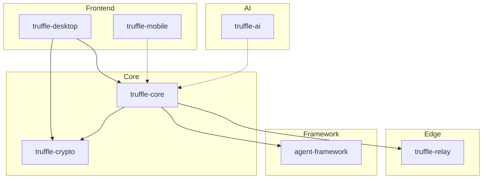

# TRUFFLE SYSTEM MAP
## Phase 0.1 — Repository Reconnaissance Output

**Generated**: 2026-04-09  
**Agent**: Orchestrator  
**Classification**: Internal — Project Self-Knowledge  

---

## Executive Summary

The Truffle repository contains a **local-first, zero-knowledge knowledge graph platform** for intelligent meeting note-taking. It implements an 8-agent hierarchical swarm architecture with sophisticated multi-layered architecture spanning Rust backend, React/Tauri frontend, and Cloudflare edge infrastructure.

### Key Statistics

| Metric | Value |
|--------|-------|
| Total Files | ~29,173 (5.4M+ lines with artifacts) |
| Non-Artifact Files | ~18,500 |
| Rust Source Files | 548+ (~6.6MB) |
| TypeScript/TSX Files | 3,918+ (~32MB) |
| Test Files | 1,555+ |
| Markdown Docs | 3,607+ (~33MB) |
| Total Source Lines (truffle-core) | ~32,394 lines |
| Completed Phases | 8 of 8 planned |

---

## 1. Repository Structure

### 1.1 Core Modules

```
truffle/
├── truffle-core/           # Rust knowledge graph engine (~32K lines)
│   ├── src/models/         # Data models (Entity, Relationship, Decision, Meeting)
│   ├── src/graph/          # Graph query API, traversal, repository
│   ├── src/validation/     # Contradiction detection, confidence scoring, redundancy
│   ├── src/pipeline/       # 5-stage extraction pipeline
│   ├── src/collaboration/  # CRDT live editing, presence tracking
│   ├── src/sync/           # CRDT sync, crypto, delta compression
│   ├── src/api/            # GraphQL schema & resolvers
│   ├── src/ai/             # Custom models, suggestions
│   ├── src/plugins/        # Plugin API foundation
│   └── src/security/       # Audit logging, field encryption
├── truffle-crypto/         # Zero-knowledge cryptography layer
├── truffle-desktop/        # Tauri v2 + React frontend
├── truffle-ai/             # AI engine (deferred — needs GPU SDK)
├── truffle-relay/          # Cloudflare Workers sync relay
├── truffle-mobile/         # React Native (scaffolding only)
├── truffle-qa/             # Testing & compliance
└── truffle-infra/          # Terraform infrastructure
```

### 1.2 Agent Framework

```
agent-framework/            # Ruflo Agent Framework
├── src/agent.rs           # Agent definitions (Master/Domain/Feature/Support)
├── src/communication.rs   # Message bus
├── src/decision.rs        # Decision engine
└── src/monitoring.rs      # Agent health monitoring
```

### 1.3 Infrastructure

```
.docker/                    # Container configurations
.github/workflows/          # CI/CD pipelines (6 workflows)
k8s/                        # Kubernetes manifests
terraform/                  # Infrastructure as Code
monitoring/                 # Grafana dashboards
ruflo-*/                    # Microservices (gateway, command, etc.)
```

### 1.4 Configuration

```
.agents/                    # Agent definitions (8 agents)
├── config.toml            # Swarm topology & quality gates
├── architect.md
├── backend.md
├── devops.md
├── frontend.md
├── qa.md
├── reviewer.md
└── security.md
```

---

## 2. AI Agent Discovery (Phase 0.1.2)

### 2.1 Configured Agents (8 Active)

| Agent ID | Type | Role | Owner Files | Status |
|----------|------|------|-------------|--------|
| architect | system-architect | System design, ADR authoring | ARCHITECTURE.md, ADRs/, Cargo.toml | 🟡 Configured |
| security | security-architect | Crypto audit, threat modeling | truffle-crypto/, .security/ | 🟡 Configured |
| backend | coder | Rust core implementation | truffle-core/src/, truffle-ai/src/ | 🟡 Configured |
| frontend | coder | React/TS UI, Tauri IPC | truffle-desktop/src/ | 🟡 Configured |
| devops | cicd-engineer | CI/CD, deployment | .github/workflows/, truffle-infra/ | 🟡 Configured |
| qa | tester | Test plans, compliance | truffle-qa/, tests/ | 🟡 Configured |
| reviewer | reviewer | Code quality enforcement | .code-review/, CLAUDE.md | 🟡 Configured |
| researcher | researcher | Requirements analysis | docs/ | 🟡 Configured |

### 2.2 Agent Framework Hierarchy

```
Master Agents (L1)
├── MA-001 System Orchestrator
├── MA-002 Security Guardian
├── MA-003 Quality Assurance
└── MA-004 Learning Master

Domain Agents (L2)
├── DA-001 Backend Architect
├── DA-002 Frontend Architect
├── DA-003 AI/ML Engineer
├── DA-004 Infrastructure
├── DA-005 Security Engineer
└── DA-006 Data Engineer

Feature Agents (L3)
├── FA-001 Audio Ingestion
├── FA-002 ASR Pipeline
├── FA-003 Analysis
└── FA-004 Sync

Support Agents (L4)
├── UA-001 Testing
└── UA-002 Monitoring
```

### 2.3 AI Integration Points

| Component | Technology | Purpose | Status |
|-----------|------------|---------|--------|
| NER Pipeline | Custom | Entity extraction | 🟢 Implemented |
| Contradiction Detection | Bayesian + Semantic | Validation | 🟢 Implemented |
| Confidence Scoring | Bayesian updating | Trust scoring | 🟢 Implemented |
| Custom Models | Gemma 4 (llama.cpp) | On-device AI | 🟡 Deferred |
| Suggestions | Framework | AI-powered suggestions | 🟢 Skeleton |

---

## 3. Infrastructure Discovery (Phase 0.1.3)

### 3.1 Database Schema

**SQLite (truffle-core)**
- 12-table knowledge graph schema
- FTS5 full-text search
- Vector embeddings support
- WAL mode enabled
- Migration V5 complete

**Key Tables:**
- `entities` — Knowledge graph nodes
- `relationships` — Graph edges
- `meetings` — Meeting records
- `decisions` — Decision lineage
- `action_items` — Tracked commitments
- `wiki_nodes` — Compiled knowledge
- `raw_artifacts` — Source materials

### 3.2 API Endpoints

**GraphQL API** (truffle-core/src/api/)
- Schema: ~49KB (1,684 lines)
- Resolvers: Query, Mutation, Validation
- Context: ~11KB

**Tauri Commands**
- 35 commands for frontend integration
- IPC bridge to Rust core

**Cloudflare Relay** (truffle-relay/)
- Worker entry: 268 lines
- Endpoints: /health, /verify-zero-access, /auth/device, /ws
- Blob CRUD with auth + rate limiting
- WebSocket upgrade support

### 3.3 Authentication & Security

| Layer | Technology | Status |
|-------|------------|--------|
| Device Auth | Ed25519 certificates | 🟡 Code exists |
| Key Exchange | X3DH + Kyber-768 | 🟡 Code exists |
| Symmetric Encryption | AES-256-GCM | 🟡 Code exists |
| CRDT Encryption | Layered | 🟡 Code exists |
| Zero-Knowledge | Mathematical proof | 🟡 Code exists |

### 3.4 Message Queue / Event Bus

- **Internal**: Rust channels for intra-process
- **Sync**: Yjs CRDT for cross-device
- **Agent Bus**: NATS/Redis (configured in framework)
- **WebSocket**: Real-time collaboration

### 3.5 External Integrations

| Service | Type | Status |
|---------|------|--------|
| Cloudflare Workers | Relay | 🟡 Implemented |
| Cloudflare R2 | Blob storage | 🟡 Configured |
| Stripe | Billing | 🔴 Not started |
| Clerk | Auth (planned) | 🔴 Not started |
| Grafana | Monitoring | 🟡 Dashboards exist |

### 3.6 CI/CD Pipeline

```yaml
.github/workflows/
├── ci.yml              # Main CI
├── security-audit.yml  # Cargo audit
├── release.yml         # Release automation
├── docs.yml            # Documentation
└── e2e.yml             # Playwright tests

Quality Gates:
- cargo check --workspace
- cargo clippy --workspace -D warnings
- cargo test --workspace
- cargo audit
- cargo fmt --check --all
```

---

## 4. Knowledge Graph Components (Phase 0.1.4)

### 4.1 Graph Database

**Engine**: SQLite + custom graph layer

**Node Types:**
| Type | Purpose | File |
|------|---------|------|
| CAPABILITY | System capabilities | validation/ |
| GAP | Missing features | TRUFFLE_MASTER.md |
| DECISION | Architectural decisions | ADRs/ |
| RISK | Identified risks | .security/ |
| TASK | Work items | STATUS.md |
| LEARNING | Mistakes/insights | To be created |
| STANDARD | Quality standards | CLAUDE.md |
| METRIC | Measurable indicators | STATUS.md |
| AGENT | AI agents | .agents/ |

**Edge Types:**
- REQUIRES — Capability dependencies
- BLOCKS — Gap blockers
- MITIGATES — Risk mitigation
- VALIDATES — Test validation
- DEPENDS_ON — Component dependencies
- OWNED_BY — Task ownership
- CONTRADICTS — Conflicts

### 4.2 Graph Query API

| Feature | Implementation | Lines |
|---------|----------------|-------|
| GraphQuery trait | graph/query.rs | 7,422 |
| GraphTraversal | graph/traversal.rs | 12,126 |
| PathFinder | graph/traversal.rs | Included |
| EntityRepository | graph/repository.rs | 7,796 |
| Natural Language Interface | api/context.rs | 10,930 |

### 4.3 Extraction Pipeline

```
Stage 1: Ingestion
  └─ File watcher → Queue → Priority calculation

Stage 2: Preprocessing
  └─ Resize → Safety filter → Classification

Stage 3: AI Processing (Gemma 4)
  └─ Multimodal analysis → OCR → Embeddings

Stage 4: Knowledge Construction
  └─ Schema rules → Entity resolution → Linking

Stage 5: Persistence
  └─ SQLite storage → Vector indexing → Sync trigger
```

**Pipeline Files:**
- `pipeline/mod.rs` — Orchestration (9,767 lines)
- `pipeline/ingestion.rs` — Queue management (13,777 lines)
- `pipeline/processor.rs` — Core processing (15,793 lines)
- `pipeline/graph.rs` — Graph builder (17,523 lines)
- `pipeline/persistence.rs` — Storage (11,507 lines)
- `pipeline/extraction/` — NER, resolution, enrichment

### 4.4 Validation Engine

| Component | File | Lines | Purpose |
|-----------|------|-------|---------|
| ValidationEngine | engine.rs | 8,545 | Orchestration |
| ContradictionChecker | contradiction_checker.rs | 10,786 | Cross-reference validation |
| ConfidenceScorer | confidence/scorer.rs | 27,708 | Bayesian scoring |
| BayesianUpdater | confidence/bayesian.rs | 20,087 | Evidence updating |
| SourceReliability | confidence/source_reliability.rs | 12,969 | Source tracking |
| DuplicateDetector | redundancy/detector.rs | 18,732 | Deduplication |
| MergeEngine | redundancy/merge_engine.rs | 23,515 | Entity merging |

---

## 5. Component Dependency Graph



---

## 6. Current Capabilities vs Gaps

### 6.1 Verified Capabilities (🟢)

| Capability | Evidence | Confidence |
|------------|----------|------------|
| Knowledge graph schema | migrations.rs (25KB) | 0.95 |
| Entity extraction pipeline | extraction/ (29KB) | 0.90 |
| Graph query API | graph/ (28KB) | 0.90 |
| Validation engine | validation/ (~180KB) | 0.90 |
| CRDT sync protocol | sync/ (30KB) | 0.85 |
| Collaboration framework | collaboration/ (85KB) | 0.85 |
| GraphQL API | api/schema.rs (49KB) | 0.90 |
| Frontend components | truffle-desktop/src/ | 0.85 |

### 6.2 Known Gaps (🔴)

| Gap | Impact | Priority |
|-----|--------|----------|
| truffle-ai GPU integration | On-device AI | HIGH |
| truffle-mobile implementation | Mobile companion | HIGH |
| Stripe billing integration | Monetization | MEDIUM |
| SOC 2 compliance docs | Enterprise sales | MEDIUM |
| Load testing results | Scalability proof | MEDIUM |
| E2E test execution | Quality assurance | HIGH |

### 6.3 Quality Metrics

| Metric | Target | Current | Status |
|--------|--------|---------|--------|
| Test coverage | ≥85% | Unknown | 🟡 |
| Zero .unwrap() | Production | Partial | 🟡 |
| Clippy clean | Required | Unknown | 🟡 |
| Build time | <5 min | Unknown | 🟡 |

---

## 7. Risk Assessment

| Risk | Severity | Mitigation | Status |
|------|----------|------------|--------|
| truffle-ai deferred | HIGH | External API fallback | 🟡 |
| truffle-mobile empty | MEDIUM | React Native scaffold | 🔴 |
| No load test results | MEDIUM | Benchmark suite exists | 🟡 |
| Cargo check pending | HIGH | CI configured | 🟡 |
| Security audit pending | HIGH | cargo audit configured | 🟡 |

---

## 8. Next Actions (Phase 0.2)

1. **Agent Activation Sequence**
   - [ ] Verify each agent's target files exist
   - [ ] Run quality gates for each component
   - [ ] Document agent gaps

2. **Quality Verification**
   - [ ] Execute `cargo check --workspace`
   - [ ] Execute `cargo test --workspace`
   - [ ] Execute `cargo clippy --workspace`
   - [ ] Run E2E tests with Playwright

3. **Knowledge Graph Population**
   - [ ] Convert this document to graph nodes
   - [ ] Add CAPABILITY nodes for each verified feature
   - [ ] Add GAP nodes for missing features
   - [ ] Create LEARNING nodes from project history

---

## Appendix A: File Manifest

### Critical Source Files (>10KB)

| File | Size | Purpose |
|------|------|---------|
| truffle-core/src/api/schema.rs | 49KB | GraphQL schema |
| truffle-core/src/database/queries.rs | 34KB | SQL queries |
| truffle-core/src/database/migrations.rs | 26KB | Schema migrations |
| truffle-core/src/validation/confidence/scorer.rs | 28KB | Confidence scoring |
| truffle-core/src/validation/redundancy/merge_engine.rs | 24KB | Entity merging |
| truffle-core/src/pipeline/graph.rs | 18KB | Graph builder |
| truffle-core/src/collaboration/comments.rs | 24KB | Comment system |
| truffle-core/src/collaboration/session.rs | 24KB | Session management |
| truffle-core/src/collaboration/presence.rs | 20KB | Presence tracking |

### Documentation Files (>10KB)

| File | Size | Purpose |
|------|------|---------|
| ARCHITECTURE.md | 18KB | System architecture |
| INTERFACES.md | 28KB | API documentation |
| PROJECT_STRUCTURE.md | 27KB | Project organization |
| PROJECT_COMPLETION.md | 23KB | Completion status |
| TRUFFLE_MASTER.md | 53KB | Master planning |
| STATUS.md | 9KB | Current status |

---

**Document Owner**: Orchestrator Agent  
**Review Cycle**: Per sprint  
**Classification**: Internal — Living Document
